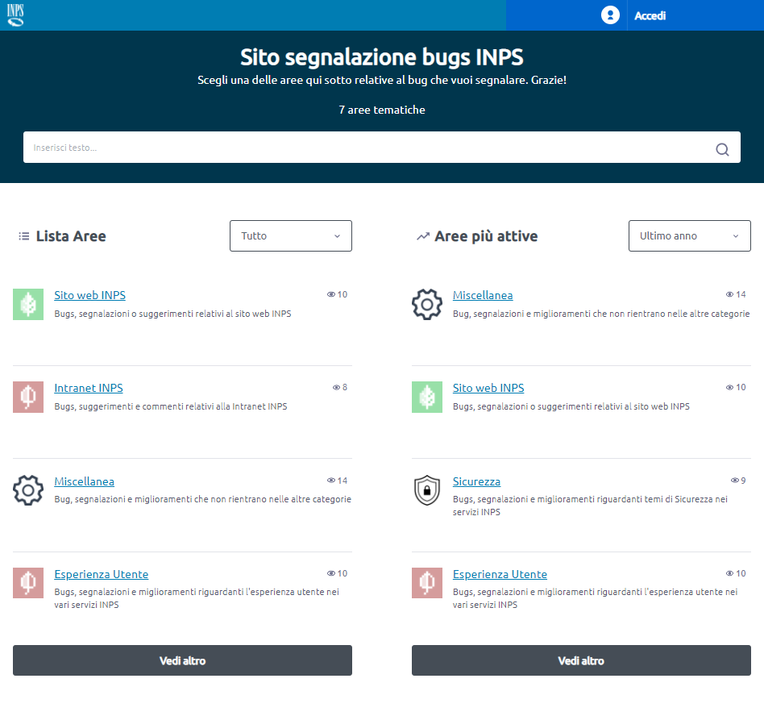
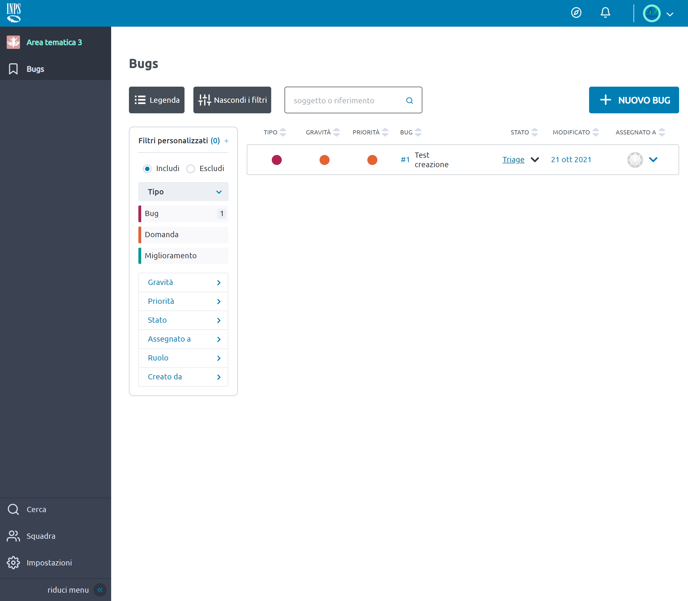

# INPS Bug Tracking

## Overview

La piattaforma INPS Bug Tracking è un progetto basato sul progetto di project management opensource [Taiga.io](https://www.taiga.io/). L'obiettivo di INPS Bug Tracking è fornire agli utenti che utilizzano i servizi online INPS una maniera facile ed intuitiva per riportare problemi, porre domande e dare suggerimenti sull'utilizzo.

### Caratteristiche principali:

 - Accesso ed interazione basata su un sistema a ruoli
 - Autenticazione tramite l'integrazione di SPID, CIE e CNS tramite l'IdP INPS "PassiWeb"
 - Gestione squadra dello Staff
 - Sistema di segnalazione bug, che include:
	 - Creazione segnalazione bug con allegati ed editor "Rich Text"
	 - Commenti segnalazioni bug con allegati ed editor "Rich Text"
	 - Funzionalità per moderazione segnalazioni bug e relativi commenti
	 - Tagging delle segnalazioni bug, assegnazione ad un membro staff della segnalazione
 - Categorie e colori categorie segnalazioni bugs personalizzabili
 - Una ricca lista di filtri per la lista delle segnalazioni bug, che include::
	 - Gravità, priorità e tipologia
	 - Stato del Bug
	 - Tag personalizzati
	 - Ruolo dell'utente creatore della segnalazione Bug
 - Motore di ricerca globale

E altro.

<table>
<td width="50%">

</td>
<td width="50%">

</td>
<table>


## Setup di sviluppo

- Configura il tuo backend creando il file `config/back-config.py` (da `config/back-config.py.example`).
- Configura il tuo frontend creando il file `config/front-config.json` (da `config/front-config.json.example`).
- Ricorda di settare il campo `loginSpidUrl` in `config/front-config.json` come segue:

```json
"loginSpidUrl": "/spid/login/?idp=https://localhost:8080"
```

- Se vuoi testare la funzionalità di invio mail, modifica le seguenti chiavi in `config/back-config.py`:

```python
DEFAULT_FROM_EMAIL = "email.user@emailhost.com"
EMAIL_HOST ='smtp.emailhost.com'
EMAIL_PORT ='587'
EMAIL_USE_TLS = True
EMAIL_HOST_USER = 'email.user@emailhost.com'
EMAIL_HOST_PASSWORD = 'emailhostpassword'
```

- Lancia il server di sviluppo con

```sh
make run-dev
```

- Il server di sviluppo sarà disponibile all'indirizzo `https://localhost`

### Registra utenti locali ed effettua l'accesso

- La prima volta che aprirai `https://localhost`, troverai un bottone blu nell'angolo in alto a destra con l'etichetta "Accedi". Cliccalo.
- Il browser mostrerà la pagina di accesso di "SPID Validator", qui uoi usare username `validator` e password `validator`
- Nel menu di sinistra, espandi la voce "Metadata SP" e clicca su "Download". Nel campo Metadata URL inserisci la url `https://taiga-gateway/spid/metadata/` e clicca il bottone "Download".
- Nel menu di sinistra, espandi la voce "Response" e clicca sulla voce "Check Response".
- Nel form sulla destra cerca il campo "email". In questo campo incolla l'indirizzo email che vuoi usare per l'utenza (devi per forza incollare, questo campo non ammette scrittura manuale). Annotalo da parte, ti servirà più tardi per creare l'utenza di Amministratore.
- Effettua lo scroll in basso della pagina e clicca sul bottone verde "Invia response al Service Provider"
- Fatto, ora dovresti aver effettuato l'accesso come "Utente Cittadino" e non sarai in grado di creare nuove Aree Tematiche.

### Fornisci ad un utente il ruolo di Amministratore
- Per iniziare, assicurati di aver completato la procedura "Registra utenti locali ed effettua l'accesso" almeno una volta e di avere a portata di mano l'indirizzo email scelto per l'utente amministratore.
- Apri una sessione bash nel container taiga-back:

```sh
docker-compose exec taiga-back bash
```

- Entra nella directory taiga-back e inizia la procedura Django per la creazione di uno super user:

```sh
cd taiga-back && python manage.py createsuperuser
```

- Quando verrà chiesto l'indirizzo email, fornisci l'indirizzo usato nello SPID Validator per la creazione dell'utenza.

- Nel browser, effettua il logout e ri-effettua l'accesso tramite la procedura descritta dello SPID Validator, e se hai inserito correttamente l'indirizzo email dovresti avere il ruolo di Admin.

### Modifica dei componenti Angular

Alcuni componenti utilizzati dalla piattaforma sono il risultato del progetto
Angular `"taiga-front-next"`. Per modificarli è necessario modificare il codice Angular,
poi lanciare:

```sh
npm run deploy:elements
```

Nella cartella `taiga-front-next/dist/elements` si troverà il file elements.js, che verrà automaticamente copiato in `taiga-contrib-inps/front/custom-taiga-override`. Se è già avviato il container taiga-front e si vuole vedere immediatamente la modifica, copiare il file `taiga-front-next/dist/elements/elements.js` nel container con il comando:

```sh
docker cp ./taiga-front-next/dist/elements/elements.js <idcontainer-taiga-front>:/taiga-front/elements.js
```

## Lanciare i test

Prepara l'ambiente di test

```sh
make prepare-test
```

Lancia i test

```sh
make test
```

## Confidential Bugs

In aggiunta alla piattaforma INPS Bug Tracking, eventuali bug di sicurezza possono essere segnalati in modo confidenziale scrivendo direttamente a confidential-bugs@inps.it. 

Le email possono essere inviate anche usando cryptazione PGP: la chiave pubblica è disponibile in questo repository nella cartella extras, e in aggiunta anche sui PGP keyserver Ubuntu e MIT.

## Crediti

Grazie ai seguenti progetti utili a capire come customizzare Taiga
- [Taiga Contrib GitHub Auth](https://github.com/kaleidos-ventures/taiga-contrib-github-auth/)
- [Taiga Dark Theme](https://github.com/Monogramm/taiga-dark)
