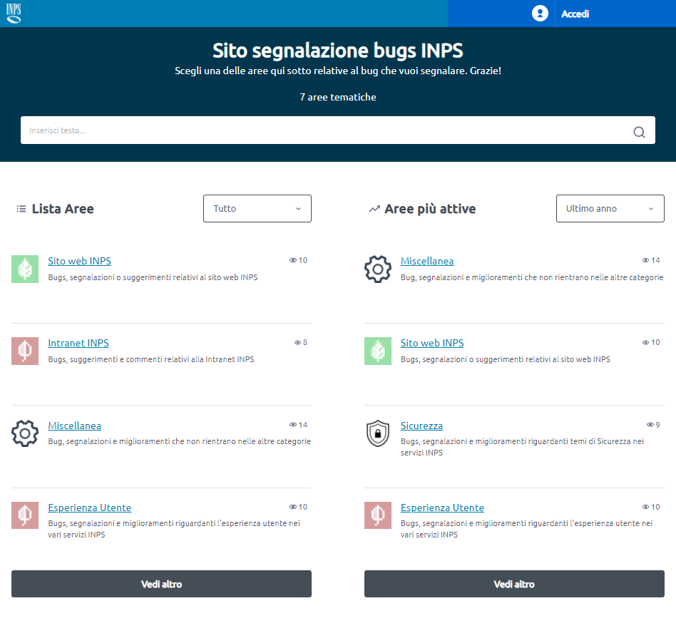

# INPS Bug Tracking
*Read this in other languages: [🇮🇹 Italian](README.it.md).*

## Overview

INPS Bug Tracking platform is a project based on the [Taiga.io](https://www.taiga.io/) opensource project management software, with the goal to provide INPS online services users a simple, streamlined way to report software bugs, ask usage questions and make suggestions.

### Main features:

 - Role based user access and interaction
 - Authentication provided via the official Italian Government Identity Access Management system integration (SPID, CIE and CNS via the INPS IdP "PassiWeb")
 - Staff team management
 - Full project bug reports management, which include:
	 - Bug report creation with attachments and rich text editing
	 - Rich text bug report comments with attachments
	 - Bug report and comments moderation functionality
	 - Bug report tagging and assignment
 - Customizable bugs categories names and colors
 - A rich set of bugs filtering, including:
	 - Severity, priority and tipology
	 - Bug status
	 - Custom tags
	 - Creator user role
 - Global search engine

And more.

<table>
<td width="50%">

</td>
<td width="50%">

</td>
<table>
	
***Click on screenshots***
	
## Dev Setup

- Configure your backend project creating `config/back-config.py` file (from `config/back-config.py.example`).
- Configure your frontend project creating `config/front-config.json` file (from `config/front-config.json.example`).
- Remember to set `loginSpidUrl` in `config/front-config.json` as following:

```json
"loginSpidUrl": "/spid/login/?idp=https://localhost:8080"
```

- If you want to test the email features, edit the following keys in `config/back-config.py`:

```python
DEFAULT_FROM_EMAIL = "email.user@emailhost.com"
EMAIL_HOST ='smtp.emailhost.com'
EMAIL_PORT ='587'
EMAIL_USE_TLS = True
EMAIL_HOST_USER = 'email.user@emailhost.com'
EMAIL_HOST_PASSWORD = 'emailhostpassword'
```

- Launch dev server

```sh
make run-dev
```

- Your dev server will be visible at `https://localhost`

### Register and login local authenticated users

- The first time you'll open `https://localhost`, there will be a blue button in the upper right corner labeled "Accedi". Click it.
- The browser will show the "SPID Validator" login page, you can use username `validator` and password `validator`
- In the left menu, expand the "Metadata SP" menu and click on "Download". In the Metadata URL field input the url `https://taiga-gateway/spid/metadata/` and clic the "Download" button.
- In the left menu, expand the "Response" menu and then click on "Check Response".
- In the right form, look for the "email" field. In the email filed paste (you have to paste in the field, since just input writing is not allowed) the email address you want to be the username of the user. Write it down, you'll need it later when creating the admin user.
- Scroll down and click the green button labeled "Invia response al Service Provider"
- Done, you should be now logged in as a "Standard User" with no rights to create new Theme Areas.

### Give a registered user the Admin role
- To begin with, you should have completed the "Register and login local authenticated users" procedure at least one time and remember the email address used to create the user you want to be admin.
- Open a bash in the taiga-back container:

```sh
docker-compose exec taiga-back bash
```

- Enter in the taiga-back directory and start Django super user creation procedure:

```sh
cd taiga-back && python manage.py createsuperuser
```

- When prompted for email address, input the email address you used to create the user in the SPID Validator

- Now logout and login again using the validator, and if you used the correct email address you should have now the Admin Role.

### Modify Angular components

Some components used by the platform are the result of the project
Angular `"taiga-front-next"`. To modify them, you need to modify the Angular code,
then run:

```sh
npm run deploy:elements
```

In `taiga-front-next/dist/elements` folder you will find the elements.js compiled file,
which is automatically copied by the npm script in `taiga-contrib-inps/front/custom-taiga-override`.
If the container `taiga-front` is already started and you want to see your
changes immediately, copy the file `taiga-front-next/dist/elements/elements.js`
to `taiga-front` container using the command:

```sh
docker cp ./taiga-front-next/dist/elements/elements.js <idcontainer-taiga-front>:/taiga-front/elements.js
```

## Run tests

Prepeare test env

```sh
make prepare-test
```

Run tests

```sh
make test
```

## Confidential Bugs

In addition to the INPS Bug Tracking platform, potential security bugs can be submitted in a confidential manner writing directly to confidential-bugs@inps.it. 

These emails may also be sent using PGP encryption: the public key is available in this repository under the extras folder, and in the Ubuntu and MIT PGP keyservers too.

## Credits

Thank you to these amazing projects we started from to understand how to customize
Taiga
- [Taiga Contrib GitHub Auth](https://github.com/kaleidos-ventures/taiga-contrib-github-auth/)
- [Taiga Dark Theme](https://github.com/Monogramm/taiga-dark)
