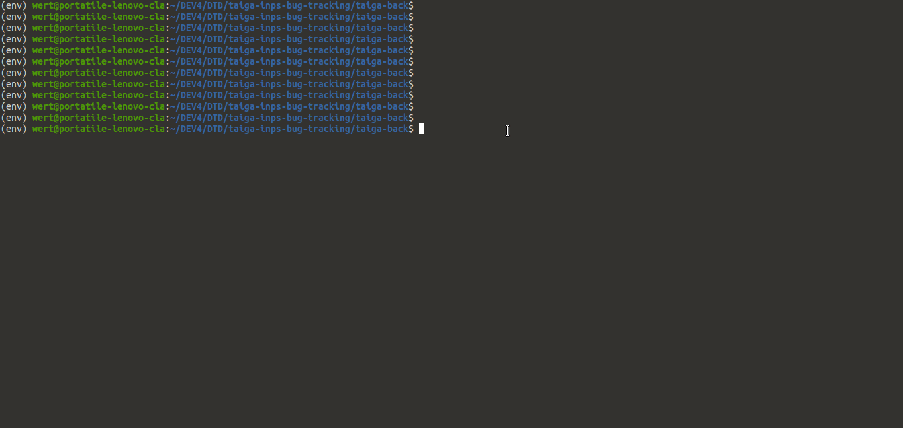

## Raw dev env setup

Prerequisites:

- Git 2.24+
- Python 3.8+ (with virtualenv)
- Node 12+
- PostgreSQL 13+

SPID Prerequisites:

- xmlsec
- libssl-dev
- libsasl2-dev

Using a Debian based GNU/Linux distribution:

````
apt install xmlsec1 libssl-dev libsasl2-dev
````

### Clone project and init

Clone the project

```
git clone git@github.com:INPS-it/taiga-inps-bug-tracking.git
```

Setup Taiga repositories for development purpose

```
./scripts/init_taiga_dev.sh
```

### Setup data storage

Use a postgres Docker image for development purpose
```
docker image pull  postgres:13.2-alpine
docker run --name some-postgres -p 5432:5432 -e POSTGRES_PASSWORD=postgres -d postgres:13.2-alpine
```

Create a new database named `taiga` using PostgreSQL

```
createdb taiga -h localhost
```

### Setup Taiga backend

Create and activate a new virtual environment with Python 3.8+.

Configure your backend project creating `config/back-config.py` file (from `config/back-config.py.example`).
This file will override default configuration for back-end development.

Create a superuser for development

```
cd taiga-back
export DJANGO_SETTINGS_MODULE="settings.config"
python manage.py createsuperuser
```

To start backend server run from root
```
./scripts/dev_taiga_back.sh
```

The API endpoint is http://localhost:8000/api/v1/

### Setup Taiga frontend

Configure your frontend project creating `config/front-config.json` file (from `config/front-config.json.example`).
This file will override default configuration for front-end development.

You can find custom theme settings inside `taiga-inps-theme`.

To start frontend server and watcher, run

```
./scripts/dev_taiga_front.sh
```

And go in your browser to: http://localhost:9001/

⚠️ If you can't use SPID/CIE during development, set

```
"defaultLoginEnabled": true
```

in your `config/front-config.json` file to enable default login form

### Setup Taiga INPS plugin development environment

Taiga INPS plugin backend gets automatically installed during backend startup.

To start a watcher for frontend development, go in the front folder inside the
plugin

```
cd taiga-contrib-inps/front
```

then install dependencies

```
npm i
```

and run dev server!

```
npm run serve
```

### SPID SAML2 integration

You have to run the demo project in https, otherwise the browser will block the cookies in cross domain POST.

`pip install uwsgi`

⚠️ SSL support needed on Mac OSX

```
CFLAGS="-I/usr/local/opt/openssl@1.1/include" LDFLAGS="-L/usr/local/opt/openssl@1.1/lib" UWSGI_PROFILE_OVERRIDE=ssl=true pip install uwsgi -Iv --no-cache-dir
```

then you must run [spid-saml-check](https://github.com/italia/spid-saml-check), here a [brief documentation](https://github.com/italia/spid-saml-check#how-to-build-with-docker) to get things up and running.

then run the development server

````
./manage.py collectstatic

uwsgi \
    --http-keepalive \
    --https 0.0.0.0:8000,./certificates/public.cert,./certificates/private.key \
    --module taiga.wsgi:application \
    --env settings.config \
    --chdir .
````

Here's metadata: https://localhost:8000/spid/metadata/

Here's the login trigger: https://localhost:8000/spid/login/?idp=http://localhost:8080

Here's a working demo:


